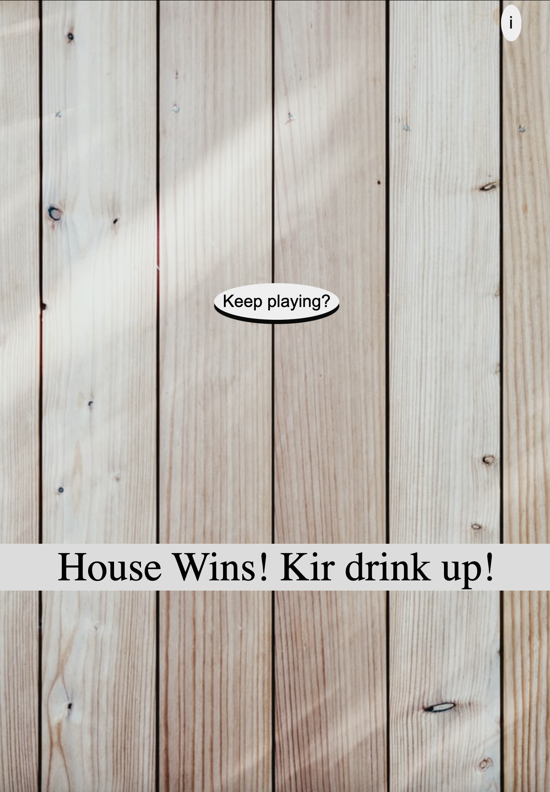

# BlackJack 

> Good old BlackJack on the rocks with a little bit of twist.

### Overview 

The objective of the game is to beat the House && be the last man standing.
Two cards are dealt to each player. The goal is to get your card total as close to 21 as possible. 

- If the card total = 21 ==> BlackJack
- If the card total > 21 ==> Bust

The player can choose to Hit(get another card) or Stand(stick to the cards in hand) after receiving the initial cards. 


> As far as drinking goes, there are:

```
_<!— 3 Simple Rules  —>_

For (round = 0;   round < till.everyone.is.drunk;   round++) {

	if (glitch in the game === "true") {
		Everyone drinks!

	}else if ( House lost === "true" ) {
		Player gives out a drink! 

	} else {
		Player drinks! 
}


Cheers! 

```

### Screenshot




### Technologies Used

- HTML 
- CSS
- JS 

### Getting Started 

Here is the **<a href="">link</a>** to the game! Have Fun! Bottoms up but please drink responsibly:) 


### Next Steps: Planned future enhancements (icebox items).
- Responsiveness is still a work in progress. At the moment, the game best looks in smaller viewport:) 
- More efficient shuffling function will be implemented.
- Will try to smooth the transition between plays.
- Add sound effects

